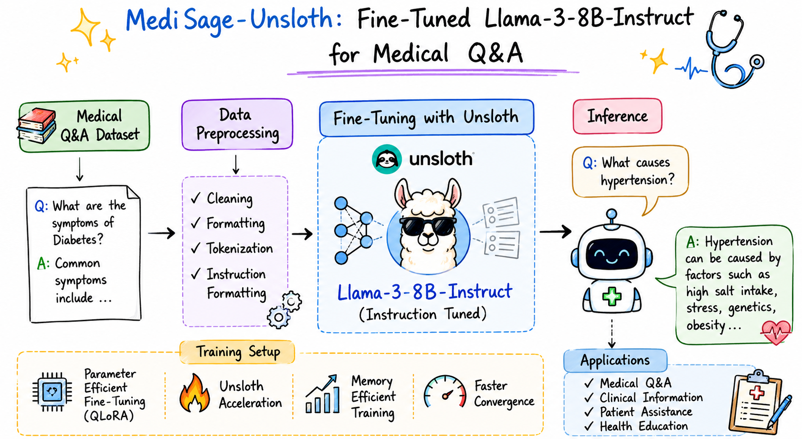
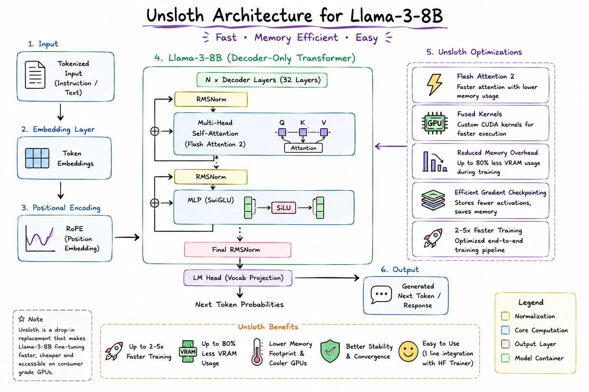

# Unsloth-MediSage

### Efficient Fine-Tuning of Llama-3-8B-Instruct for Medical Question Answering using Unsloth

<p align="center">
  
</p>

<h1 align="center">🩺 Unsloth-MediSage</h1>

<h3 align="center">
Fine-Tuning Llama-3-8B-Instruct for Medical Question Answering using Unsloth
</h3>

<p align="center">
  
  
  
  
  
  
</p>

---

# 📖 Overview

**Unsloth-MediSage** is a domain-specific Medical Question Answering (Medical QA) model developed by fine-tuning **Llama-3-8B-Instruct** on a **Medical Q&A Dataset** using **Unsloth**. The project focuses on adapting a general-purpose Large Language Model into a medical assistant capable of generating accurate, context-aware, and instruction-following responses for healthcare-related questions while maintaining efficient memory utilization and faster training.

---

# Features

* Medical Question Answering
* Fine-tuned Llama-3-8B-Instruct
* Efficient Fine-Tuning with Unsloth
* Medical Q&A Instruction Dataset
* Reduced Memory Consumption
* Context-Aware Response Generation
* Ready for Inference & Deployment
* Foundation for Future PEFT Research

---

# Model Architecture

<p align="center">
  
</p>

---

# Technology Stack

* Python
* PyTorch
* Hugging Face Transformers
* Unsloth
* TRL
* Accelerate
* BitsAndBytes
* Datasets

---

# Dataset

The model is fine-tuned on a **Medical Question & Answer Dataset** containing healthcare-related questions and corresponding expert-style answers formatted for instruction tuning.

### Example

**Input**

```text
What are the symptoms of asthma?
```

**Output**

```text
Common symptoms include wheezing, shortness of breath,
chest tightness, and persistent coughing.
```

---

# Applications

* Medical Question Answering
* Healthcare Virtual Assistant
* Patient Education
* Medical Information Retrieval
* Healthcare AI Research
* Clinical Knowledge Assistance

---

# Model Efficiency

One of the key advantages of using **Unsloth** is its memory-efficient optimization. While the original **Llama-3-8B-Instruct** model occupies approximately **15 GB**, the optimized **Unsloth** implementation requires only **~5.7 GB** for fine-tuning and inference, making it significantly more accessible on consumer-grade GPUs while maintaining strong task-specific performance.

---

# Future Work

* 🔹 Integrate **LoRA (Low-Rank Adaptation)** for Parameter-Efficient Fine-Tuning (PEFT)
* 🔹 Retrieval-Augmented Generation (RAG) for evidence-based responses
* 🔹 Multi-turn Medical Conversations
* 🔹 Clinical Document Question Answering
* 🔹 FastAPI and Hugging Face Spaces Deployment
* 🔹 Quantization and Edge Device Optimization

---
